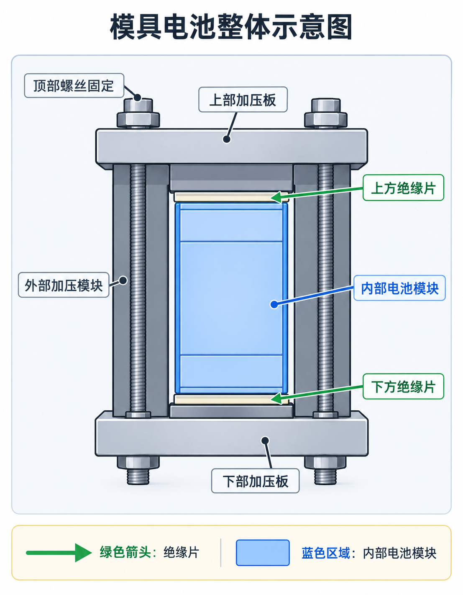
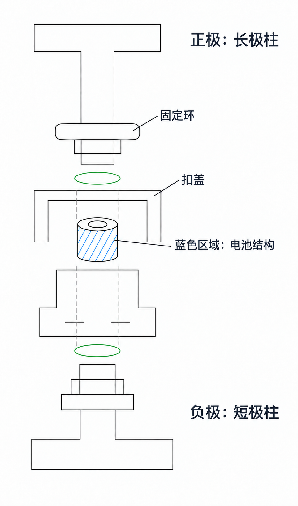
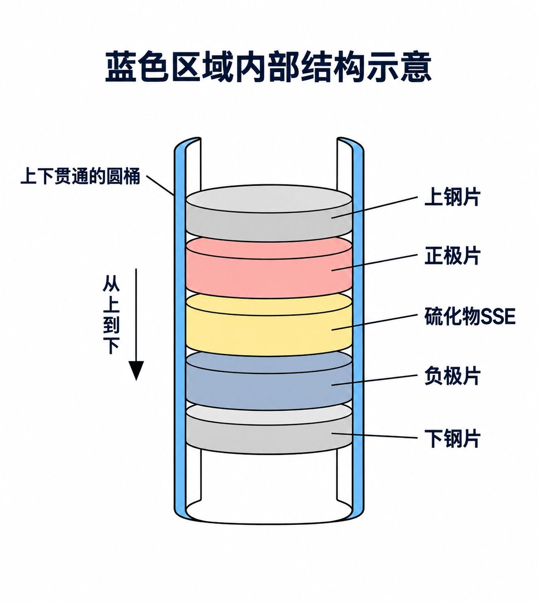

# 第一部分：大模具电池示意

## 说明

以下图片用于说明大模具电池的零件组成、上下关系和内部结构。图片只代表零件和结构的大致示意，不代表真实的尺寸关系、比例关系或加工尺寸；实际结构应以实物、设计图纸和后续测量记录为准。

## 1. 模具电池整体结构

图 1 用于表示大模具电池的整体组成：外部加压模块位于外侧，上部和下部加压板通过顶部螺丝固定；中间蓝色区域表示内部电池模块，上、下方的绝缘片位于内部电池模块与外部加压结构之间。

## 2. 蓝色区域的平面结构示意

图 2 对蓝色区域及其上下连接关系进行平面化表示：正极为长极柱，负极为短极柱；正极侧下方标注为扣盖，正极柱体上的环状结构标注为固定环；蓝色区域表示容纳电池结构的圆桶。

## 3. 蓝色圆桶内部的圆片堆叠

图 3 表示蓝色区域内部的层状结构。蓝色区域是一个上下贯通的圆桶，内部放置多张圆片，从上到下依次为：

1. 上钢片；
2. 正极片；
3. 硫化物 SSE；
4. 负极片；
5. 下钢片。

## 当前记录边界

- 本部分只记录结构示意和零件层序；
- 暂不将示意图作为真实尺寸、压力方向、装配公差或材料厚度的依据；
- 后续可根据实物照片、尺寸测量和实际装配过程继续补充安装与拆卸步骤。
